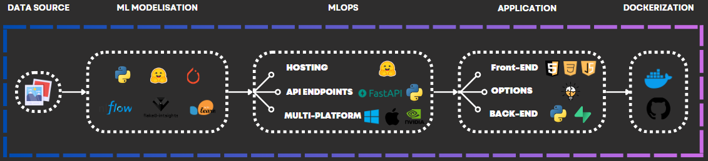

# QuickDraw API

Welcome to the QuickDraw API repository. This project encompasses the development of a machine learning model and its deployment through a user-friendly application. The complete project details are available [here](https://github.com/mlengineershub/QuickDraw-ML).


## Project Workflow



1. **Machine Learning Model Development**
    - The initial phase involved developing the machine learning model. Detailed information about the model can be found [here](https://github.com/mlengineershub/QuickDraw-ML).

2. **API Endpoint Deployment**
    - We deployed the API endpoints using `FastAPI` in `Python`.

3. **User Interface Development**
    - A user-friendly application interface was created using `HTML`, `CSS`, and `JavaScript`.
    

4. **Containerization**
    - The final application was containerized using `Docker`.

## Repository Structure

| File/Folder        | Description                                         |
|--------------------|-----------------------------------------------------|
| `app/`             | Contains the files related to application development. |
| `endpoints/`       | Contains the files for API endpoints.               |
| `.gitignore`       | Specifies files and directories to be ignored by Git. |
| `.dockerignore`       | Specifies files and directories to be ignored by Docker files. |
| `docker-compose.yml` | The docker compose yaml file for app launching. |
| `Dockerfile.txt` | The main docker file for the app. |
| `README.md` | Short Documentation overview. |
| `requirements.txt` | Lists all the dependencies required for the project. |

## Getting Started

1. Clone the repo or download the `docker-compose.yml` file

* To clone the repo : 
```bash
git clone https://github.com/mlengineershub/QuickDraw-API.git
cd QuickDraw-API
```

2. Run the `docker-compose.yml` :

```bash
docker-compose up -d
```

- Note : You can modify some parameters such as the port and the device directly in the `docker-compose.yml` 


3. Go to : `localhost:PORT` (Default PORT = 5500) in your browser  


## Contributing

We welcome contributions to enhance the QuickDraw API. To contribute:

1. Fork the repository.
2. Create a new branch (`git checkout -b feature-branch`).
3. Commit your changes (`git commit -am 'Add new feature'`).
4. Push to the branch (`git push origin feature-branch`).
5. Create a new Pull Request.

## Contact

For any inquiries or feedback, please contact us.
