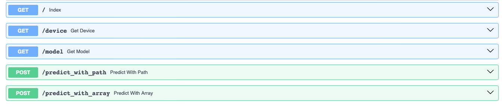

# Endpoints Directory

This directory contains API implementations for image classification using models fine-tuned on the Quickdraw dataset. The models are hosted on Hugging Face and configured via environment variables specified in a `.env` file 
located at the root of the project.

## Overview

The `endpoints/` directory includes three Python scripts, each designed to run the image classification API on different hardware setups: CPU, GPU, and MPS (Apple's Metal Performance Shaders). The API uses `FastAPI` for serving predictions via HTTP requests.

## File/Folder Description

| File/Folder      | Description |
| ---------------- | ----------- |
| `predict_cpu.py` | Launches the API using CPU for inference. This is suitable for environments without a dedicated GPU. |
| `predict_gpu.py` | Launches the API using a GPU. This requires a CUDA-compatible GPU and relevant NVIDIA drivers and libraries. |
| `predict_mps.py` | Launches the API using Apple MPS, optimizing performance on macOS devices with Apple silicon. |

## Prerequisites

- FastAPI
- Uvicorn
- PyTorch
- Transformers library from Hugging Face
- A `.env` file containing:
  - `MODEL_CKPT`: Model checkpoint on Hugging Face
  - `HOST`: Host address (usually `localhost` or `127.0.0.1`)
  - `PORT_ENDPOINT`: Port number for the API server

## Setup and Execution

1. **Environment Setup:**
   - Install required packages:   
   `pip install -r requirements.txt`

2. **Configuration:**
   - Create a `.env` file in the root directory with the following content:
     ```
     MODEL_CKPT=<model-checkpoint>
     HOST=localhost
     PORT_ENDPOINT=8000
     ```

3. **Running the API:**
   - Navigate to the directory containing the desired script based on your hardware.
   - Execute the script using Uvicorn:
     ```
     python endpoints/predict_cpu.py # For CPU
     python endpoints/predict_gpu.py # For GPU
     python endpoints/predict_mps.py # For MPS
     ```
   - Access the API at `http://localhost:8000/docs` to interact with the Swagger UI and test the endpoints.

## API Endpoints

- `GET /`: Returns a welcome message and a link to the API documentation.
- `GET /device`: Returns the type of device being used for inference.
- `GET /model`: Returns the model checkpoint.
- `POST /predict_with_path`: Accepts an image path and returns the classification results.
- `POST /predict_with_array`: Accepts an image as a nested list of integers and returns the classification results.



## Additional Notes

- Ensure that the model checkpoint specified in `.env` matches the device compatibility (CPU/GPU/MPS).
- Modify the host and port settings as required by your deployment environment.

